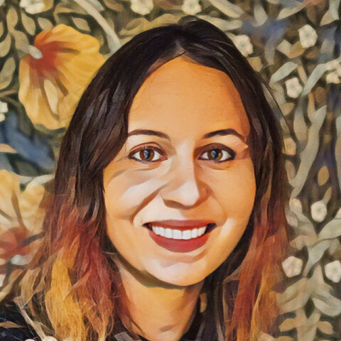

{.talk-photo fig-alt="Dr. Rebecca Böhme"}

**Talare / Speaker:** Dr. Rebecca Böhme
**Datum / Date:** Måndag 5 oktober 2026 / Monday 5 October 2026, 12:15–13:00
**Plats / Venue:** Stockholms universitet, Albanohus 4, plan 3: Jordgubbe / Stockholm University, Albano House 4, floor 3: Jordgubbe
**Online:** [Zoom](https://umu.zoom.us/j/6429428957)

Välkommen att delta på plats eller online. Föredraget är kostnadsfritt.
*Join us on site or online. The talk is free of charge.*

<!-- After the talk: change status to "tidigare" above and add e.g. [Inspelning / Recording](https://...) -->
